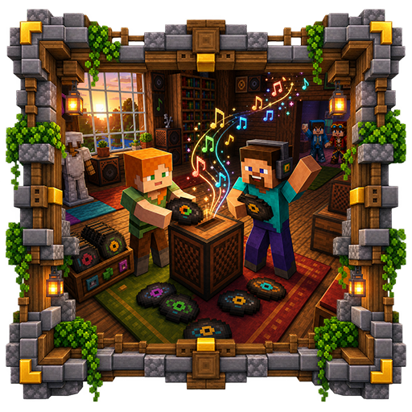

<p align="center">
  
</p>
<h1 align="center">Custom Jukebox Plugin</h1>
<p align="center">
  <b>Play Note Block Studio songs through signs, redstone, or a personal music browser.</b><br>
  <b>Organize large song libraries into folders and control playback without leaving the game.</b>
</p>
<p align="center">
  <a href="https://github.com/Cobbleworks/Custom-Jukebox-Plugin/releases"></a>&nbsp;&nbsp;<a href="https://github.com/Cobbleworks/Custom-Jukebox-Plugin/blob/main/LICENSE"></a>&nbsp;&nbsp;&nbsp;&nbsp;&nbsp;&nbsp;&nbsp;&nbsp;
</p>

Custom Jukebox indexes `.nbs` songs only when needed and presents them through an inventory-based browser. Players can listen privately, while administrators can turn signs into world jukeboxes controlled by interaction or redstone. Folder navigation keeps even large song collections manageable.

### **Core Features**

- **Folder-aware song browser:** Subdirectories become navigable folders in the in-game GUI
- **Personal playback:** Play or stop a song without creating a world jukebox
- **Jukebox signs:** Store the selected song, volume, looping, and redstone mode directly on a sign
- **Three redstone modes:** Toggle, pulse, or ignore external redstone power
- **Registered-sign index:** List configured signs and their locations with an admin command
- **Lazy song loading:** Scan metadata without keeping every complete song in memory
- **Action-bar status:** Show the active personal song while it is playing
- **Live reload:** Rescan the song library without restarting the server

### **Supported Platforms**

- **Server Software:** Paper
- **Minecraft Version:** 26.2
- **Java Requirement:** Java 25+
- **Required Plugin:** NoteBlockAPI 1.7.0

## **Table of Contents**

1. [Getting Started](#getting-started)
    - [Prerequisites](#prerequisites)
    - [Installation Steps](#installation-steps)
    - [Verifying Installation](#verifying-installation)
2. [Third-Party Plugins](#third-party-plugins)
    - [NoteBlockAPI](#noteblockapi)
3. [Configuration](#configuration)
4. [How It Works](#how-it-works)
    - [Song Library](#song-library)
    - [Jukebox Signs](#jukebox-signs)
    - [Redstone Modes](#redstone-modes)
5. [Commands](#commands)
6. [Permissions](#permissions)
7. [Building from Source](#building-from-source)
8. [License](#license)
9. [Screenshots](#screenshots)

## **Getting Started**

### **Prerequisites**

- A **Paper 26.2** server
- **Java 25** or newer
- [NoteBlockAPI 1.7.0](https://www.spigotmc.org/resources/noteblockapi.19287/)

### **Installation Steps**

1. Download the latest Custom Jukebox jar from [Releases](https://github.com/Cobbleworks/Custom-Jukebox-Plugin/releases)
2. Download `NoteBlockAPI-1.7.0.jar` from the official NoteBlockAPI release page
3. Stop the server and copy both jars into its `plugins/` directory
4. Start the server once, then add `.nbs` files under `plugins/CustomJukebox/songs/`
5. Use `/jukebox play` to browse the library or create a `[jukebox]` sign

Song subfolders are shown as folders in the browser, so the directory structure can be used to group albums, areas, or event music.

### **Verifying Installation**

- Run `/plugins` and confirm that both `NoteBlockAPI` and `CustomJukebox` are green
- Run `/jukebox play` and confirm that the song browser opens
- Run `/jukebox reload` after adding a test `.nbs` file and confirm that it appears

## **Third-Party Plugins**

### NoteBlockAPI

[NoteBlockAPI](https://github.com/koca2000/NoteBlockAPI) reads and plays Note Block Studio files. It is a required server plugin and is not included in the Custom Jukebox release artifact. Version 1.7.0 or a compatible newer release must be installed separately.

NoteBlockAPI is maintained by its own contributors and distributed under the GNU Lesser General Public License v3.0. Questions about song parsing or sound playback should first be checked against its [project documentation](https://github.com/koca2000/NoteBlockAPI).

## **Configuration**

The generated `config.yml` controls playback volume and source limits.

| Setting | Description | Default |
|---------|-------------|---------|
| `volume.min` | Lowest value accepted by signs and the GUI | `0` |
| `volume.max` | Highest value accepted by signs and the GUI | `10` |
| `volume.default` | Initial volume for a new jukebox sign | `3` |
| `personal-default-volume` | Initial personal playback volume | `3` |
| `max-active-sources` | Combined limit for sign and personal playback sources | `20` |
| `log-invalid-songs` | Log malformed or unreadable `.nbs` files during scans | `true` |

Values above `1` use Minecraft's extended audible radius behavior. A volume of `0` is silent.

## **How It Works**

### **Song Library**

Songs are stored below `plugins/CustomJukebox/songs/`. The plugin indexes the library and opens folders as inventory screens. `/jukebox reload` refreshes the index after files are added, replaced, or removed.

### **Jukebox Signs**

Write `[jukebox]` on the first line of a sign. The configuration screen opens after the sign editor closes, allowing the creator to select a song, volume, looping option, and redstone mode. Right-clicking a configured sign opens its controls; sneak-right-click uses normal sign editing.

The sign stores its own configuration using Paper's persistent data container. `signs.yml` maintains a separate location index used by `/jukebox list-signs`.

### **Redstone Modes**

| Mode | Behavior |
|------|----------|
| `Toggle` | Plays while the sign is powered and stops when power is removed |
| `Pulse` | Starts playback on a rising redstone edge |
| `Ignore` | Ignores redstone and responds only through the GUI |

## **Commands**

| Command | Description |
|---------|-------------|
| `/jukebox play` | Open the personal song browser and playback controls |
| `/jukebox play <path or title>` | Start a song directly |
| `/jukebox stop` | Stop personal playback |
| `/jukebox reload` | Rescan the song library |
| `/jukebox list-signs` | List registered jukebox signs and their locations |

## **Permissions**

| Permission | Description | Default |
|------------|-------------|---------|
| `customjukebox.play` | Use personal playback | `true` |
| `customjukebox.sign.place` | Create and configure jukebox signs | `op` |
| `customjukebox.admin` | Reload songs and list registered signs | `op` |

## **Building from Source**

**Requirements:** Java 25 and Maven 3.9+

```bash
git clone https://github.com/Cobbleworks/Custom-Jukebox-Plugin.git
cd Custom-Jukebox-Plugin
mvn clean verify
```

The plugin jar is written to `target/custom-jukebox-x.x.x.jar`. NoteBlockAPI is resolved from CodeMC for compilation and remains a separate runtime plugin.

## **License**

This project is licensed under the **MIT License**. See [LICENSE](LICENSE) for details.

## **Screenshots**

<table>
  <tr>
    <th>Custom Jukebox - Management GUI</th>
    <th>Custom Jukebox - Adventure Playback</th>
  </tr>
  <tr>
    <td><a href="https://github.com/Cobbleworks/Custom-Jukebox-Plugin/raw/main/images/screenshot-management-gui.png"></a></td>
    <td><a href="https://github.com/Cobbleworks/Custom-Jukebox-Plugin/raw/main/images/screenshot-adventure-playback.png"></a></td>
  </tr>
  <tr>
    <th>Custom Jukebox - Sign Creation</th>
    <th>Custom Jukebox - Redstone Sign Setup</th>
  </tr>
  <tr>
    <td><a href="https://github.com/Cobbleworks/Custom-Jukebox-Plugin/raw/main/images/screenshot-sign-creation.png"></a></td>
    <td><a href="https://github.com/Cobbleworks/Custom-Jukebox-Plugin/raw/main/images/screenshot-redstone-sign-setup.png"></a></td>
  </tr>
  <tr>
    <th>Custom Jukebox - Registered Signs</th>
    <th>Custom Jukebox - Reload Command</th>
  </tr>
  <tr>
    <td><a href="https://github.com/Cobbleworks/Custom-Jukebox-Plugin/raw/main/images/screenshot-registered-signs.png"></a></td>
    <td><a href="https://github.com/Cobbleworks/Custom-Jukebox-Plugin/raw/main/images/screenshot-reload-command.png"></a></td>
  </tr>
</table>
